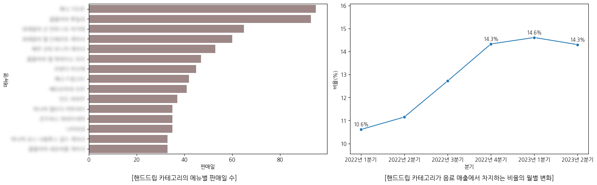
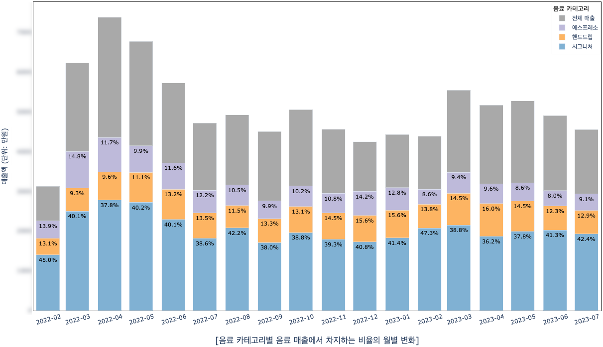
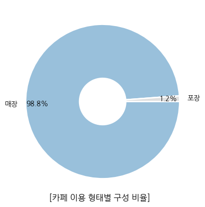
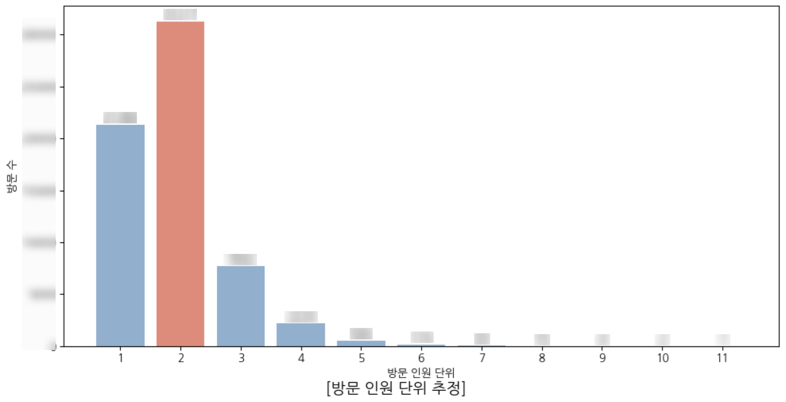
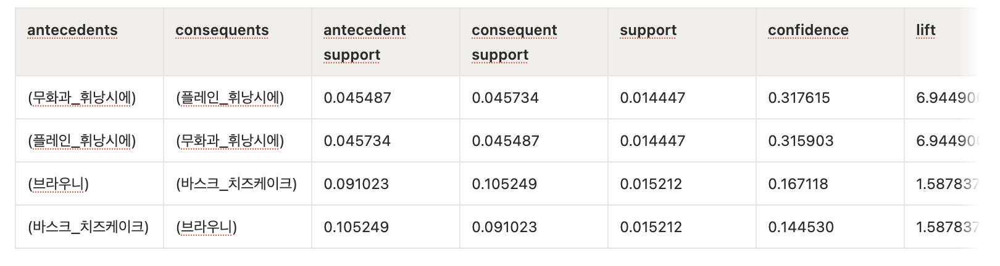

# 커피OO 데이터 분석 

제주 로컬 카페 커피OO의 POS 거래 데이터 기반 매출 분석 및 운영 전략 제안한 프로젝트입니다. 

## 1. 프로젝트 개요

| 항목 | 내용 |
| --- | --- |
| 프로젝트 유형 | Team Project |
| 분석 데이터 | CoffeeOO POS 거래 데이터 |
| 데이터 기간 | 2022.02.10 ~ 2023.07.30 |
| 데이터 규모 | 163,421 rows x 25 columns |
| 담당 | 팀장 / 전처리 / 매출 분석 / 연관성 분석 / 결과 종합 |
| 분석 환경 | Python, Jupyter Notebook |
| 주요 라이브러리 | pandas, numpy, matplotlib, seaborn, ariori |
| 분석 기법 | EDA, 시계열 매출 분석, 카테고리 메뉴 분석, 연관성 분석 |

## 2. Business Problem

커피OO은 매출 감소 상황에서 매출 개선과 브랜드 경험 강화를 위한 구체적인 운영 방향이 필요한 상황이었습니다.

또한, 커피OO은 제주 공항 근처 2호점을 오픈할 예정이었으며 새로 오픈할 2호점은 기존 1호점과 지리적 위치 및 환경이 다른 상황이었습니다.


## 3. Key Findings

**① CoffeeOO만의 특색 있는 메뉴 수요 확인**

특정 원두 핸드드립은 평균 판매기간이 약 **12일**로 원두 교체가 잦음에도 음료 매출에서 일정 수준 이상의 비중을 유지했고,

시그니처, 핸드드립, 에스포레스 등 커피OO의 특색 있는 메뉴가 음료 매출의 약 **67%**를 차지했습니다.

**② 매장 중심의 이용 형태**

포장보다 매장 이용 비중이 높게 나타나 커피OO가 단순 테이크아웃 매장보다 **오프라인에서 커피를 경험하는 공간**으로 기능하고 있음을 확인했습니다.

**③ 2인 세트 메뉴 구매 조합 도출**

방문 인원을 추정한 결과, 매장을 찾는 고객의 단위는 평균 1.89명이며, 2인 단위 방문이 많은 구조로 나타났습니다.


연관성 분석에서는 음료-디저트 조합에서 **휘낭시에를 중심으로 한 조합**, 음료-음료에서는 **시그니처 메뉴 및 동일 메뉴의 서로 다른 원두 조합**이 확인되었습니다.

**④ 운영 전략 제안**

1. 커피OO은 일반적인 카페 운영 방식에서 벗어나 **커피에 특화된 매장으로의 전략적 전환을 고려할 시점**입니다. 최근 커피 시장에서는 감각적·행동적 체험이 고객 만족과 충성도를 높이는 중요한 요소로 자리 잡고 있으며, 커피의 향과 맛 등 본질적인 품질을 중시하는 **프리미엄 커피 소비 트렌드**도 뚜렷하게 나타나고 있습니다. 이러한 소비 변화에 대응하기 위해 커피OO은 **차별화된 오프라인 커피 경험을 제공하는 커피 특화 매장**으로 전환할 필요가 있습니다.

2.제주공항 인근에 오픈 예정인 2호점은 유동 인구가 많은 입지 특성을 고려하여, **연관성 분석을 통해 함께 구매되는 경향이 확인된 메뉴 조합을 기반으로 2인 세트 메뉴를 구성할 것을 제안**합니다. 이를 통해 고객이 메뉴를 보다 간편하게 선택할 수 있도록 하고, 2호점의 입지 특성에 적합한 메뉴 구성을 마련하고자 합니다.


## 4. Dataset

- 기간: 2022.02.10 ~ 2023.07.30
- 데이터: CoffeeOO POS 거래 데이터
- 규모: 163,421 rows x 25 columns

주요 정보

- 결제 일시
- 상품명
- 상품 카테고리
- 판매 수량
- 판매 금액
- 주문 유형(매장/포장)

주요 전처리

- 결측치 및 이상치 처리
- 상품명 및 카테고리 표준화
- 날짜/시간 파생변수 생성
- 평일/주말 구분
- 계절 변수 생성
- 매장 이용 형태 재분류
- 연관성 분석을 위한 주문 단위 데이터 변환

## 5. 프로젝트 아키텍처

```text
cafe_project/
├── README.md
├── data/
│   └── POS 거래 데이터
├── notebooks/
│   ├── 데이터 전처리
│   ├── 매출 및 메뉴 분석
│   └── 연관성 분석
└── outputs/
    ├── 시각화 결과
    └── 분석 인사이트
```

분석 흐름

```text
Raw POS Data
    ↓
Data Preprocessing
    ↓
Sales & Product EDA
    ↓
Store Usage Analysis
    ↓
Association Rule Analysis
    ↓
Business Recommendations
```

## 6. 방법론

**1. Data Preprocessing**

- 월별 POS 데이터를 통합하고 분석 가능한 형태로 정리
- 결제일시, 결제년월, 결제시간대, 요일, 계절 등 파생변수 생성
- 상품명과 카테고리 표기를 표준화하여 동일 메뉴가 하나의 값으로 집계되도록 처리
- 취식 방법을 매장/포장 기준으로 재분류

**2. Sales Analysis**

- 월별 매출 추이 분석
- 시간대별 매출 및 운영시간 효율 분석
- 평일/주말, 요일, 계절에 따른 매출 차이 분석

**3. Product Analysis**

- 메뉴 대분류별 매출 비중 분석
- 음료, 원두, 디저트, MD 카테고리별 매출 및 판매량 분석
- 핸드드립 메뉴의 월별 고유 메뉴 수와 메뉴별 판매일 수 분석
- 에스프레소 카테고리의 월별 매출 및 메뉴별 비중 변화 분석

**4. Store Usage Analysis**

- 매장/포장 이용 형태별 구성 비율 분석
- 매장 이용 형태별 카테고리 누적 주문 건수 비교
- 오프라인 공간 이용 중심의 고객 구매 특성 파악

**5. Association Rule Analysis**

- 동일 주문 내 함께 구매된 메뉴 조합을 기준으로 연관 규칙 분석 수행
- 지지도, 신뢰도, 향상도를 활용해 의미 있는 구매 패턴 도출
- 세트 메뉴 구성 및 프로모션 전략 수립에 활용

**6. Business Recommendations**

- 특색 메뉴 중심의 브랜드 경험 강화
- 핸드드립과 시그니처 메뉴를 활용한 차별화 전략
- 연관 구매 조합 기반 세트 메뉴 및 업셀링 전략 제안
